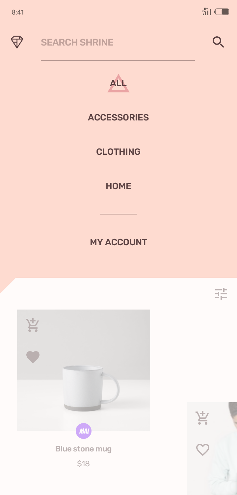

# Shrine
 An e-commerce or retail mobile application built solely with Jetpack Compose.

[Shrine](https://m2.material.io/design/material-studies/shrine.html) uses Material Design 2 components and Material Theming to express branding for a variety of fashion and lifestyle items.

  ## Screenshots
|Launch screen with Shrine logo|Dummy Login screen|Shrine catalogue shown using weaved image list|Expanding bottom sheet for shopping cart and wishlist|
|:---:|:---:|:---:|:---:|
|||||
|Item Detail screen|Checkout screen|Customized navigation drawer in backdrop|User Account screen|
|||||

[more screenshots](screenshots)

In this project, you'll find:
*   User Interface built with **[Jetpack Compose](https://developer.android.com/jetpack/compose)**
*   A single-activity architecture, using **[Navigation Compose](https://developer.android.com/jetpack/compose/navigation)**.
*   A presentation layer that contains Compose screens (View) and **ViewModels** for all screens (or feature).
*   Reactive UIs using **[Flow](https://developer.android.com/kotlin/flow)** and **[coroutines](https://kotlinlang.org/docs/coroutines-overview.html)** for asynchronous operations.
*   A **data layer** with a repository and a data source (local using Room and a fake list of shop items).

## Developed with
* [Jetpack Compose](https://developer.android.com/jetpack/compose) - Jetpack Compose is Android’s recommended modern toolkit for building native UI.
* [Compose Navigation](https://developer.android.com/jetpack/compose/navigation) - Allows you navigate between Composables while taking advantage of the Navigation component’s infrastructure and features.
* [Datastore](https://developer.android.com/topic/libraries/architecture/datastore) - Jetpack DataStore is a data storage solution that allows you to store key-value pairs asynchronously.
* [Room Database](https://developer.android.com/training/data-storage/room) - A persistent local data storage
* [Material Design 2](https://m2.material.io) - An adaptable, though not the latest, system of components and tools that support the best practices of user interface design for building beautiful apps.
* [Compose Animation](https://developer.android.com/jetpack/compose/animation) - API for implementing various animations in your app's UI for a smooth user experience.
* [Kotlin Coroutine](https://kotlinlang.org/docs/coroutines-overview.html) - For executing tasks asynchronously.
* [Stateflow](https://developer.android.com/kotlin/flow/stateflow-and-sharedflow) - An observable state-holder that emits data stream to its collectors - updating the UI incessantly.
* [ViewModel](https://developer.android.com/topic/libraries/architecture/viewmodel) - Stores UI-related data that isn't destroyed on UI changes.